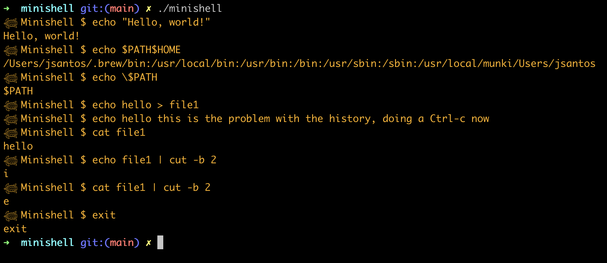

# minishell

This is a project from the 42 curriculum, in which we are supposed to build our own shell.
The subject can be found in the repo. 
We implemented an <b>Abstract Syntax Tree</b> to work with the pipes. 
Please note that, depending on the version of the readline lib you have on your computer, the line might not display correctly when going through history.   
PS: If you're wondering about the turtles, the name of our team was Ninja Turtles, so there you go!
